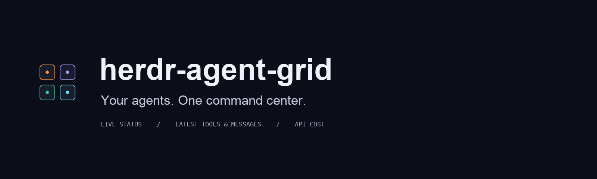
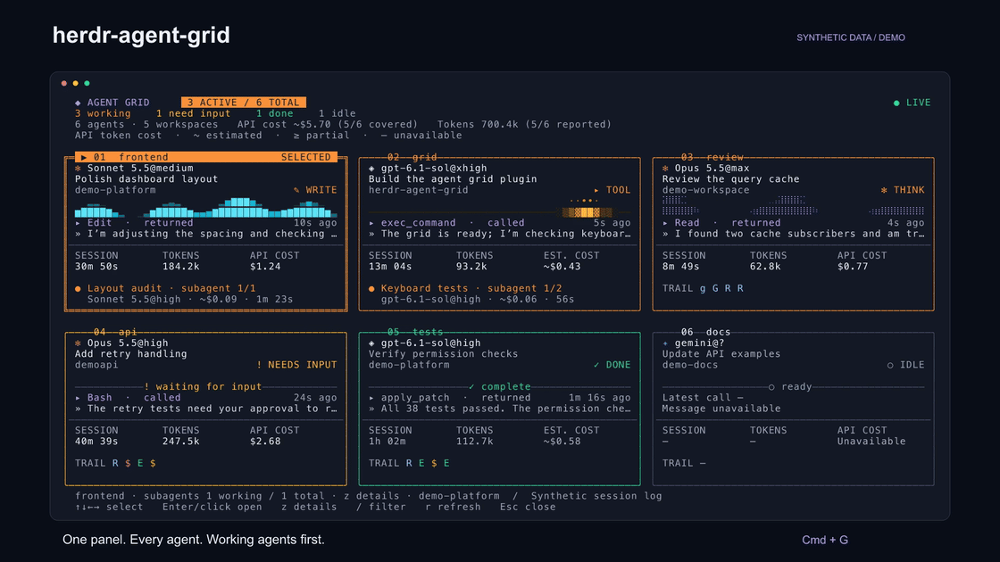

<p align="center">
  
</p>

<p align="center">
  <strong>A full-panel command center for the agents running in Herdr.</strong><br>
  Working agents first. Harness icons. Subagents. Latest messages. Clear API cost.
</p>

<p align="center">
  <a href="#get-started">Get started</a> ·
  <a href="docs/media/demo.mp4">Watch the 30-second demo</a> ·
  <a href="docs/metrics.md">Metric sources</a> ·
  <a href="benchmarks/README.md">Performance</a>
</p>

<p align="center">
  
  
  
  
</p>



*All demo agents, messages and costs are synthetic. The video renders the same
TUI draw commands as the plugin, with scripted updates and navigation.*

## See the whole team

Trigger one panel to see agents across every workspace in your current Herdr
session. Each card tells you what the agent is doing, what it said most
recently, how long it has been running, and its token usage and API cost.
Select a card and press Enter to jump straight to its terminal.

| At a glance | In the panel |
| --- | --- |
| **Active work first** | A prominent `ACTIVE / TOTAL` count shows working agents across the inventory. Stable ordering puts working agents first. |
| **A readable visual language** | Orange for working, green for done, explicit text labels for every state. Small violet, cyan and amber cores indicate thinking, writing and tool activity. |
| **Harness + model** | A harness icon followed by `Model@Effort`, with model versions preserved. |
| **Delegated work** | Parent cards fill their spare rows with children, working first, with separate working/total counts. Child rows show name, `Model@Effort`, API cost and time. Press `z`, then PgUp/PgDn, to reach every child. |
| **The latest update** | Recent tool call, call age, assistant message and a compact tool trail. Expand with `z` for message context and the tool’s file target or description. |
| **Honest costs** | Reported API totals take precedence. Estimates show `~`; partial coverage shows `≥`; missing data stays unavailable. |
| **Keyboard flow** | Arrows, Vim keys, Tab, filtering, pagination and mouse selection. Responsive cards with a persistent key legend. |
| **Clear selection** | A double border and filled `SELECTED` title bar make arrow navigation easy to follow, while preserving status colors. |

The visual direction builds on [agent-swarm](https://github.com/jeffarese/agent-swarm).
Phase animation indicates observed activity; it is not a throughput chart.

## Get started

Built in **Rust**. Requires Herdr 0.9+ on macOS 11+ or
Linux with glibc 2.35+. Native releases support Apple Silicon, Intel Macs, and
Linux x86_64/ARM64. **No compiler is needed for release bundles.**

Download the archive for your platform from [Releases](https://github.com/jeffarese/herdr-agent-grid/releases/latest),
extract it somewhere permanent, and run `./install.sh --open` inside it.
Checksums are published in `SHA256SUMS`.

Herdr's [GitHub plugin installer](https://herdr.dev/docs/cli-reference/#plugins)
also runs the manifest build hook to prepare the native executable:

```sh
herdr plugin install jeffarese/herdr-agent-grid --ref v2.0.2
herdr plugin action invoke herdr-agent-grid.open
```

Use the release/source installer above to add keyboard shortcuts automatically.
Herdr refuses to replace a locally linked plugin through GitHub install; update
that checkout with `git pull --ff-only && ./install.sh` instead.

Or build from source in a Herdr terminal (Rust 1.88+):

```sh
git clone https://github.com/jeffarese/herdr-agent-grid.git
cd herdr-agent-grid
./install.sh --open
```

The installer links the plugin, backs up your configuration, adds **Cmd+G**,
**prefix then A**, and **Ctrl+Alt+G**, and reloads Herdr. Re-running it is
idempotent. Existing `herdr-grid.open` bindings migrate to
`herdr-agent-grid.open`, preserving your custom keys and comments.

Use `--config /path/to/config.toml` for a custom configuration. For an existing
source installation, run `git pull --ff-only && ./install.sh`. The plugin ID
and shortcuts stay the same. Without a Rust toolchain, the source installer
downloads the matching version’s native binary and verifies its checksum.

<details>
<summary>Manual installation and upgrading from herdr-grid</summary>

```sh
herdr plugin link "$PWD" --enabled
herdr plugin action invoke herdr-agent-grid.open
```

For a manual upgrade, change any old shortcut command from `herdr-grid.open`
to `herdr-agent-grid.open`, then run `herdr server reload-config`.

To remove the plugin, run `herdr plugin unlink herdr-agent-grid`, remove its
`[[keys.command]]` shortcut block, and reload the configuration.

</details>

## Make it yours

Harness logos use an existing **Herdr Agent Icons Max** font when available.
Unicode and ASCII fallbacks work without it. The plugin does not install
fonts or change your terminal settings.

```sh
./run.sh --demo                     # Try the panel without Herdr
./run.sh --demo --icons unicode     # Portable harness marks
./run.sh --demo --icons ascii --no-motion
```

| Setting | Values |
| --- | --- |
| `HERDR_AGENT_GRID_ICONS` | `auto` (default), `font`, `unicode`, `ascii` |
| `HERDR_AGENT_GRID_MOTION` | `on` (default), `off` |
| `HERDR_AGENT_GRID_THEME` | `light` for darker accents on a light terminal |
| `HERDR_AGENT_GRID_CLAUDE_DIRS` | Additional Claude config roots, separated by `:` |

Legacy `HERDR_GRID_*` settings remain supported. `font` mode is useful when
viewing through a terminal with the icon font while the plugin runs remotely.
Colors inherit your terminal background; textual status labels remain visible
on terminals without color support.

## Controls

| Input | Action |
| --- | --- |
| Arrows or `h/j/k/l` | Select a card |
| Tab / Shift+Tab | Next / previous agent |
| Enter or click card | Focus the agent and close the panel |
| `z` | Expand or collapse details |
| `/` | Filter by name, task, workspace, status or tool |
| PgUp / PgDn or `[` / `]` | Change page; scroll subagents in expanded details |
| Click Hide completed/stale or `d` | Hide/show completed and idle agents and subagents |
| `r` | Refresh now |
| Escape / `q` | Exit details, clear a filter, or close |
| Ctrl+C | Close immediately |

In demo mode, Enter/click opens details. Cards paginate when the terminal
cannot fit every agent legibly. In expanded details with subagents,
PgUp/PgDn and `[`/`]` scroll the child list; left/right select another parent.

## Fast enough to stay out of your way

Inventory refreshes about every 750 ms on a background thread. Transcript
reads are incremental; terminal reads are skipped when a matched transcript
already supplies the tool call. Animation runs at most 10 fps and stops for
settled agents and compact cards. Unchanged snapshots, fleet totals, filtered
inventories, layouts and terminal rows are reused. Faster panes publish tool
updates immediately even while another pane is still being read.

The Rust benchmark harness measures rendering, navigation, transcript reads,
and full application startup and input response through a real terminal. All
workloads use synthetic sessions, with raw timing samples and source hashes.

[Measurements and methodology](benchmarks/README.md).

## Where the numbers come from

Herdr supplies agent lifecycle status. Claude and Codex metrics come from
local logs matched by the agent's **exact session ID or path**. Other harnesses
still get status cards; transcript-specific fields may be unavailable.

Estimated costs use bundled model rates and observed token usage. They are
API-equivalent token costs, not subscription charges or invoices. Reported
zero is a valid value. Unknown models and missing usage display `Unavailable`.

The overview deduplicates shared sessions and shows coverage. Expanded details
explain the source and partial coverage. Latest-message previews exclude
reasoning, user prompts, tool output and Claude sidechains.

Claude subagents come from the matched parent's subagent logs; Codex children
use explicit parent thread IDs. Child costs use the same `~`, `≥` and `—`
labels. Token-based estimates include discovered subagents in card and overview
costs, with an own/subagent/combined breakdown. Reported parent totals are kept
separate from child costs because their inclusion is unverified; these totals
are marked partial when children exist. Missing child effort shows `?`.
Completed child timers stop when completion is reported. Tiles use their available space for multiple
children; compact tiles show the visible range. Expanded details put children
first and scroll when needed, with a persistent row range and key hint.
Working children are orange and completed children green; unreported status
stays unknown. [See a nine-child synthetic example](docs/media/subagents.png).

[Read the full metrics and pricing notes](docs/metrics.md).

## Develop and verify

```sh
cargo fmt --all --check
cargo clippy --workspace --locked --all-targets -- -D warnings
cargo test --workspace --locked
cargo build --release --locked --workspace
./run.sh --demo --render --width 140 --height 38
./run.sh --doctor
./run.sh --list
```

Application code lives in `src/`; Rust development tools live in `tools/`.
The workspace requires Rust 1.88 or newer. Tests cover provider accounting,
streaming and lifecycle events, exact session discovery, file rotation, partial
reads, rendering fixtures, real terminal interaction and safe configuration updates.
CI runs on macOS and Linux, each on ARM64 and x86_64.

```sh
cargo xtask package --target aarch64-apple-darwin
cargo run --release --locked -p grid-tools --bin xtask -- bench
cargo xtask media
```

Media export uses the production renderer and authored synthetic fixtures.
System fonts are needed for still images; ffmpeg encodes video and GIF files.
See [release instructions](docs/release.md) and [launch copy](docs/launch.md).

[MIT licensed](LICENSE) · Built for [Herdr](https://herdr.dev)
