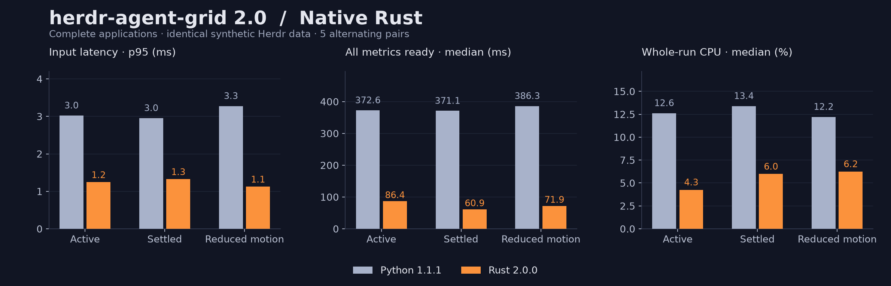

# Native Rust release: full-application comparison

Python **1.1.1** reference versus the complete Rust **2.0.0** application.
The same synthetic Herdr socket, provider stores, child logs and keyboard events
feed both implementations. These results cover live transport, exact session
matching, Claude/Codex parsing, child discovery, background refresh and rendering.



| Workload | Measurement | Python | Rust |
| --- | --- | ---: | ---: |
| Active | Key-to-paint p95 | 3.02 ms | 1.25 ms |
| Active | Initial frame | 68.61 ms | 23.25 ms |
| Active | All session metrics ready | 372.64 ms | 86.44 ms |
| Active | CPU, one core | 12.63 % | 4.26 % |
| Active | Peak memory | 35.36 MiB | 32.67 MiB |
| Settled | Key-to-paint p95 | 2.95 ms | 1.33 ms |
| Settled | Initial frame | 68.44 ms | 13.81 ms |
| Settled | All session metrics ready | 371.10 ms | 60.93 ms |
| Settled | CPU, one core | 13.40 % | 5.98 % |
| Settled | Peak memory | 35.44 MiB | 33.62 MiB |
| Reduced Motion | Key-to-paint p95 | 3.28 ms | 1.13 ms |
| Reduced Motion | Initial frame | 67.66 ms | 16.69 ms |
| Reduced Motion | All session metrics ready | 386.26 ms | 71.91 ms |
| Reduced Motion | CPU, one core | 12.22 % | 6.25 % |
| Reduced Motion | Peak memory | 35.91 MiB | 33.72 MiB |

All values are medians across paired runs except the input-latency p95, which
is pooled across every recorded key. Each workload has 5 alternating
Python/Rust pairs, 4 seconds per process, and 70 key events per run.
The terminal is 140×38. All scenarios include six parent sessions and 18 children.

The active/reduced-motion scenarios have six working parents. The settled
scenario marks parents done. The same scripted navigation, zoom and search run
in every case, so “settled” does not mean the process is idle.

Initial frame means the first painted dashboard, which can still be loading.
“All session metrics ready” means a painted frame after every parent's telemetry
(including child discovery) has been read. No fixture is preloaded into the Rust
UI. Peak memory and CPU include startup and the cold reads; CPU is the average
percentage of one core over the entire short process, **not steady-state idle
CPU**. Key timing runs after 500 ms of warmup and may overlap remaining startup
work. It measures PTY key submission to the post-paint marker, not display-panel
or terminal-compositor latency. Identical post-paint observers add small overhead
to both runtimes.

The socket server is a separate process/thread in the harness and its CPU is
excluded for both applications. Logs and OS caches can be warm. The test runs
on a shared, working machine, so scheduler load and frequency changes affect
results; raw samples and ranges should be consulted rather than treating these
figures as guarantees. Current machine: `macOS-26.7.1-arm64-arm-64bit-Mach-O`; Python
`3.14.7`; optimized Rust release build.

Each Claude parent uses the same 4,000-message transcript; each Codex parent
uses 4,000 cumulative usage records. Every run starts a fresh application and
parses identical, unchanged bytes. Native session-store caches start empty.
The harness checks that both runtimes produce identical selection, query and
zoom states after all 70 inputs. Synthetic timestamps/messages/costs are used
throughout; no live user sessions or screenshots appear in this report.

## CPU microbenchmarks

The production renderer/parser also run through the controlled comparison
adapter with identical fixtures, fixed displayed time and matched output.
These are CPU milliseconds per operation, not terminal input latency.

| Operation | Python | Rust | Median paired speedup |
| --- | ---: | ---: | ---: |
| Six-card frame | 0.3904 ms | 0.0500 ms | 8.17× |
| 1,000-agent inventory frame | 0.1500 ms | 0.0382 ms | 4.06× |
| Cold 4,000-message Claude transcript | 55.1240 ms | 8.6780 ms | 6.36× |
| Unchanged transcript poll | 0.0156 ms | 0.0135 ms | 1.06× |

[Raw microbenchmark samples](native-micro.json) include five alternating pairs.
The final rendering optimization avoids allocating sanitized copies of already
clean Unicode UI text. More invasive cache changes were left out once frame CPU
was well below one millisecond; measured input and data readiness were the
remaining useful targets. The worker wakeup addresses the latter directly.

## Correctness gates

- 176 matching draw-command frames across 6/24/100/1,000 agents, sizes, filters,
  zoom levels, Unicode text, child scrolling and reduced motion.
- Incremental file checkpoints plus replay of provider events from the existing
  telemetry, pricing and subagent regression suite.
- Same-model pricing cases covering cached tokens, long context, missing usage,
  unknown models and provider modifiers.
- Exact-store/parent matching, external symlink exclusion, long Codex headers,
  partial tails, streaming deduplication, file replacement and child resumes.
- Real PTY keyboard/mouse focus, persistent errors, clean exit and installation
  backups/idempotence; native Unix-socket and atomic-config checks.

The full local suite passes 93 Python-driven regression tests and eight native
Rust integration tests. CI repeats production checks on both architectures of
macOS and Linux; minimum Rust 1.88 and Python 3.11 compatibility are checked
separately. Timing thresholds are deliberately excluded from CI.

## Reproduce

```sh
cargo build --release --locked --examples --bin herdr-agent-grid
cargo build --release --locked --manifest-path experiments/rust-grid/Cargo.toml
python3 -m unittest discover -s tests -v
python3 benchmarks/compare_native.py --rounds 5 --seconds 4
python3 benchmarks/compare_rust.py --skip-pty --output dist/current-micro.json
python3 benchmarks/render_native_report.py
```

The report renderer uses matplotlib; the benchmark itself needs only Python's
standard library. [Full raw results](native-release.json) contain individual
runs, key latencies, source hashes and fixture hashes. [Pre-wakeup measurements](native-release-before.json) are retained. They exposed
a 250 ms UI polling delay: active-session readiness was about 263 ms before the
worker wakeup and 86 ms afterward. Those Rust revisions were measured in
separate runs, so that before/after difference is not an interleaved comparison.
Historical [prototype results](rust-comparison.md) remain unchanged and have a
narrower scope. The old prototype's much smaller memory number excludes live
session indexes and must not be attributed to the full application.
