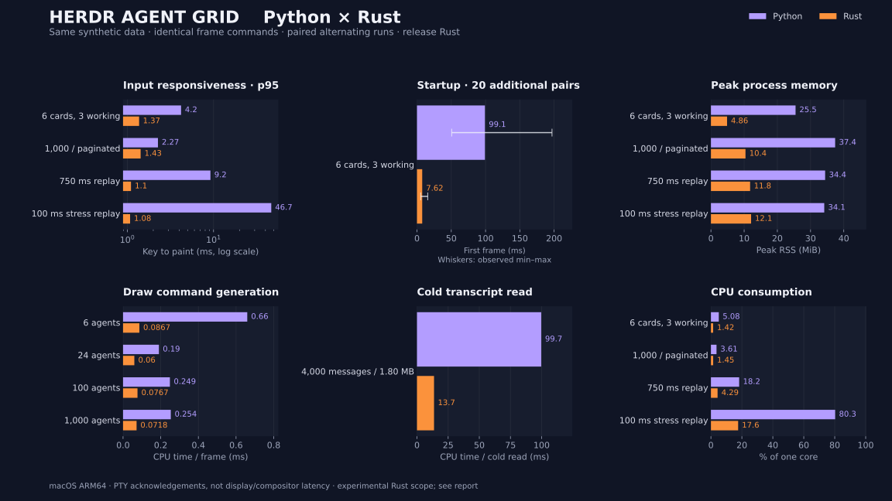

# Python vs Rust: same-data performance comparison

The Rust prototype preserves the tested card output and keyboard behavior while reducing measured CPU work, memory and input latency on this machine. It remains an experimental implementation; the installed plugin uses Python.



Measured on **2026-10-04**, macOS-26.7.1-arm64-arm-64bit-Mach-O, Python 3.14.7, rustc 1.99.0 (b940084d7 2026-09-28). All data is synthetic. Results describe this machine and workload, not every supported terminal.

## Responsiveness and process measurements

Latency is measured from the harness sending a key to receiving an acknowledgement written **after the resulting frame has been flushed**. This includes input handling, layout, drawing and terminal output. It does not measure a terminal emulator's display/compositor. Every key's selected agent, filter and detail state is checked across implementations.

| Workload | Python key p95 | Rust key p95 | Python first frame | Rust first frame | Python peak RSS | Rust peak RSS |
| --- | ---: | ---: | ---: | ---: | ---: | ---: |
| Six cards, active | 4.20 ms | 1.37 ms | 991.0 ms | 9.8 ms | 25.5 MiB | 4.9 MiB |
| Six cards, settled | 2.69 ms | 1.09 ms | 861.3 ms | 9.4 ms | 25.4 MiB | 4.8 MiB |
| Six cards, reduced motion | 2.67 ms | 1.14 ms | 118.7 ms | 8.9 ms | 25.2 MiB | 4.7 MiB |
| 1,000-agent inventory, paginated | 2.27 ms | 1.43 ms | 116.5 ms | 15.8 ms | 37.4 MiB | 10.4 MiB |
| Cold replay every 750 ms | 9.20 ms | 1.10 ms | 105.7 ms | 8.8 ms | 34.4 MiB | 11.8 MiB |
| Cold replay every 100 ms (stress) | 46.74 ms | 1.08 ms | 129.4 ms | 9.6 ms | 34.1 MiB | 12.1 MiB |

First-frame and RSS columns are medians across fresh process runs. `wait4` supplies each process's own peak RSS, avoiding the cumulative-child high-water issue in the earlier benchmark. Input p95 pools the recorded keystrokes across paired runs; raw samples and per-run summaries are included in the JSON.


### Startup variability

The main run showed substantial Python startup variation, so a separate **20-pair** alternating fresh-process repeat used the exact same six-agent fixture. Python first-frame median was **99.1 ms** (observed range 50.6–196.9 ms); Rust was **7.6 ms** (5.4–15.7 ms). The chart uses this repeat with min–max whiskers. The original profile measurements above remain available; startup is environment-sensitive and is not treated as a fixed speedup multiplier.

[Startup repeat samples](rust-startup-repeat.json). Reproduce with `python3 benchmarks/measure_rust_startup.py` after generating fixtures.

## CPU work

| Operation | Python median | Rust median | Median paired speedup |
| --- | ---: | ---: | ---: |
| Draw commands, 6 agents | 0.6596 ms | 0.0867 ms | 7.28× |
| Draw commands, 24 agents | 0.1905 ms | 0.0600 ms | 3.30× |
| Draw commands, 100 agents | 0.2488 ms | 0.0767 ms | 3.29× |
| Draw commands, 1000 agents | 0.2535 ms | 0.0718 ms | 3.19× |
| Navigate + draw, 1,000 agents | 0.2673 ms | 0.0737 ms | 3.81× |
| Change filter + draw, 1,000 agents | 0.4573 ms | 0.2389 ms | 1.93× |
| Cold read, 4,000 messages / 1.80 MB | 99.6730 ms | 13.6730 ms | 7.34× |
| Unchanged transcript poll | 0.0271 ms | 0.0211 ms | 1.35× |
| Consume one appended message | 0.2370 ms | 0.1250 ms | 1.92× |

Drawing here means generating commands, excluding terminal I/O. The inventory is paginated at 140×38; the 1,000-agent case does not draw 1,000 simultaneous cards. Ratios are the median of within-round ratios, not a ratio of unrelated historical measurements.

| Process workload | Python CPU | Rust CPU |
| --- | ---: | ---: |
| Six cards, active | 5.08% | 1.42% |
| Six cards, settled | 4.42% | 0.99% |
| Six cards, reduced motion | 4.23% | 1.01% |
| 1,000-agent inventory, paginated | 3.61% | 1.45% |
| Cold replay every 750 ms | 18.24% | 4.29% |
| Cold replay every 100 ms (stress) | 80.27% | 17.58% |

CPU percentages refer to one core and include startup, the same scripted input sequence, animations, and snapshot publication. They are not idle-only measurements and should not be compared directly with the earlier no-input PTY runs. Timing-marker bytes are excluded from terminal bandwidth; marker generation remains in both processes' CPU measurements.

## Method and equivalence gates

- **176 frames** match every command's coordinate, text and style across sizes, motion settings, pages, zoom and filters.
- **13 parser checkpoints** match metrics and byte offsets, including duplicate streaming usage, tool returns, Unicode, missing prices, partial lines, unchanged polls, replacement, cumulative cost state and bounded tails.
- **9 alternating pairs** per microbenchmark; three warmup calls followed by timed CPU batches. Append writes happen outside the measured parse interval. Equal result checksums gate every pair.
- **5 alternating pairs** per terminal workload, each targeting 6 seconds. Displayed ages are fixed. Terminal size, colors, input and data bytes are identical. Input sampling begins after a 500 ms warmup; first-frame startup remains a separate metric.
- Python uses the shipped renderer, curses paint/input loop and parser. The only app instrumentation is an optional observer after paint; the normal plugin leaves it off. Rust is built in release mode with the committed lockfile.
- The JSON records individual samples, fixture digests, source-file digests, compiler/interpreter versions and the Python base commit. Test/build/plot processes are not run alongside the final measurements.

## Scope and interpretation

The Rust prototype implements card rendering/navigation and the bounded incremental **Claude** parser exercised by these fixtures. It does **not** yet implement live Herdr IPC/focus, exact session discovery, the Codex parser, or subagent discovery/lifecycle; their display data is supplied by the shared fixture. Therefore this is evidence for the performance of these paths, not a completed migration or a whole-plugin production benchmark.

The 750 ms replay uses the current refresh interval; the 100 ms replay deliberately stresses the background worker. Each cycle cold-reads the same 1.80 MB transcript, unlike ordinary incremental steady-state polling. Both workers target the same period, but a slow parser can miss that rate; `published_snapshots_observed` records observed progress. Replay is synthetic CPU pressure, not a claim about normal live workload. The unchanged/append microbenchmarks separately measure steady state.

Python's GIL can delay UI work while its background thread parses; the observed replay results are consistent with that explanation, without proving it is the only cause. Rust uses a background thread and published snapshots. A Python process worker or free-threaded build could produce different results and was not evaluated here.

Synthetic tests exclude live Herdr IPC, agent log writers, real terminal emulator painting, font behavior, and session discovery. Absolute timings vary with machine load and power state. Windows and other machines were not measured. CI verifies functional parity on Linux/macOS without performance thresholds.

## Reproduce

```sh
. "$HOME/.cargo/env"
cargo build --release --locked --manifest-path experiments/rust-grid/Cargo.toml
python3 benchmarks/compare_rust.py --validate-only
python3 benchmarks/compare_rust.py
```

Optional chart/report regeneration (requires matplotlib):

```sh
python3 -m venv dist/benchmark-plot-venv
dist/benchmark-plot-venv/bin/pip install matplotlib
dist/benchmark-plot-venv/bin/python benchmarks/render_rust_report.py
```

[Raw measurements](rust-comparison.json) · [Rust prototype](../experiments/rust-grid/) · [Harness](compare_rust.py)
